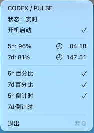

# Codex Pulse

**中文** | [English](README.en.md)

一个轻量的 macOS 菜单栏应用，用于实时查看 Codex 的 5 小时与 7 天额度。

> 非 OpenAI 官方应用，仅供个人使用和学习参考。

## 功能

- 菜单栏直接显示额度，例如：`5h: 99% - 7d: 99%`
- 支持显示 5h / 7d 百分比和倒计时
- 倒计时格式为 `HH:MM`，使用系统 SF Symbol 图标
- 菜单中始终显示完整额度数据，即使关闭所有菜单栏显示项
- 四个显示选项点击后菜单不会关闭：
  - `5h百分比`
  - `7d百分比`
  - `5h倒计时`
  - `7d倒计时`
- 菜单中提供“开机启动”开关，默认关闭，使用 macOS 原生登录项机制
- 默认每分钟刷新一次；收到额度更新事件时立即更新，并重新计算下一次刷新时间
- 纯菜单栏应用，不显示程序坞图标，也没有独立主窗口
- 支持中文和英文，跟随系统首选语言；其他语言默认显示英文

## 界面预览

状态栏显示：


菜单栏菜单：



## 登录与数据来源

本应用不提供独立登录页面，也不会保存你的密码或 API Key。它会启动本机的：

```text
codex app-server
```

然后通过 Codex App Server 请求额度数据，并监听额度更新事件。登录由本机的 ChatGPT / Codex 客户端负责。

首次使用前，请先安装并登录 ChatGPT 桌面应用或 Codex CLI。Codex CLI 的官方登录方式是运行 `codex login`，然后在浏览器中完成登录。

官方文档：

- [Codex CLI 快速入门](https://learn.chatgpt.com/zh-Hans/docs/codex/cli)
- [Codex 身份验证](https://learn.chatgpt.com/docs/auth)
- [Codex App Server](https://learn.chatgpt.com/zh-Hans/docs/app-server)

### 给其他人使用

每个用户都需要：

1. 在自己的 Mac 上安装 ChatGPT 桌面应用或 Codex CLI
2. 使用自己的 ChatGPT 账号登录
3. 安装并运行 Codex Pulse

应用不会使用开发者的账号，也不需要复制或分享任何认证文件。它显示的是当前 Mac 上已登录用户自己的额度。

## 系统要求

- macOS 26.5 或更高版本
- 提供 Intel + Apple Silicon 的 Universal 构建
- 已安装并登录 ChatGPT 桌面应用或 Codex CLI
- Xcode（仅从源码构建时需要）

## 从源码运行

```bash
git clone https://github.com/ScorpioQ/CodexData.git
cd CodexData
chmod +x script/build_and_run.sh
./script/build_and_run.sh --verify
```

也可以直接用 Xcode 打开 `CodexData.xcodeproj` 并运行。

常用命令：

```bash
./script/build_and_run.sh run       # 构建并运行
./script/build_and_run.sh --verify  # 构建、运行并检查进程
./script/build_and_run.sh --logs    # 构建、运行并查看日志
```

生成 Universal Release DMG：

```bash
./script/package_release.sh 0.1.0
```

输出文件位于 `dist/CodexPulse-0.1.0-universal.dmg`。默认生成的是未签名开发包；正式发布前需要配置 Apple Developer ID 签名和公证。

完整的证书、私钥迁移、Developer ID 签名、Apple 公证、Universal DMG 和 GitHub Release 流程，请参阅 [发布操作手册](docs/RELEASE.md)。

## 隐私与安全

- 应用没有自己的服务器
- 应用只请求额度百分比和重置时间
- 应用不读取聊天内容
- 应用不保存账号密码、API Key 或 OAuth 凭据
- 不要把本机 Codex 的认证文件打包或提交到 Git

当前实现依赖 Codex App Server 接口，因此 Codex 更新后接口变化可能导致兼容性问题。项目还需要在正式发布 DMG 前完成代码签名和公证；当前脚本主要用于本地开发和验证。

## 项目状态

这是一个个人使用的早期版本。欢迎提交 Issue 或 Pull Request。
